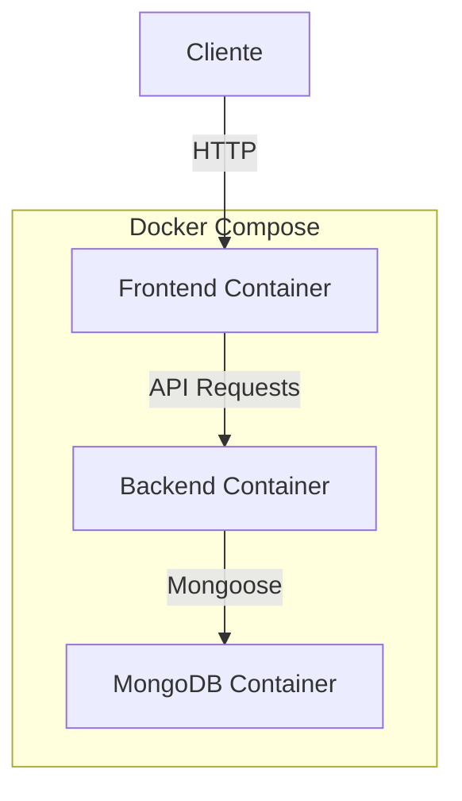

# 🚀 Blog System con Docker

Sistema de blog moderno y containerizado construido con la stack MERN (MongoDB, Express, React, Node.js).

[](https://github.com/JulianAlvarez00/my-docker-blog/blob/main/LICENSE)
[](https://www.docker.com/)
[](https://www.mongodb.com/mern-stack)

## 📋 Tabla de Contenidos

- [Características](#-características)
- [Arquitectura](#-arquitectura)
- [Requisitos Previos](#-requisitos-previos)
- [Instalación](#-instalación)
- [Uso](#-uso)
- [API Documentation](#-api-documentation)
- [Desarrollo](#-desarrollo)
- [Docker](#-docker)
- [Contribuir](#-contribuir)

## ✨ Características

- **Frontend**
  - 🎨 Interfaz moderna con React y Tailwind CSS
  - 🔍 Búsqueda y filtrado en tiempo real
  - 📱 Diseño totalmente responsive
  - 💬 Sistema de comentarios integrado

- **Backend**
  - 🔐 API RESTful con Express
  - 📦 MongoDB para almacenamiento de datos
  - 🚀 Arquitectura escalable
  - 🔄 CRUD completo para posts y comentarios

- **DevOps**
  - 🐳 Containerización con Docker
  - 🔄 Orquestación con Docker Compose
  - 📊 Monitoreo y logs
  - 🔒 Configuración segura

## 🏗 Arquitectura



## 📋 Requisitos Previos

- Docker Desktop
- Git
- Node.js (para desarrollo local)
- MongoDB (para desarrollo local)

## 🛠 Instalación

1. Clonar el repositorio:
```bash
git clone https://github.com/JulianAlvarez00/my-docker-blog.git
cd my-docker-blog
```

2. Configurar variables de entorno:
```bash
# Copiar archivos de ejemplo
cp backend/.env.example backend/.env
cp frontend/.env.example frontend/.env
```

3. Iniciar con Docker:
```bash
docker-compose up --build
```

## 💻 Uso

Acceder a:
- Frontend: http://localhost:3001
- Backend API: http://localhost:3000
- MongoDB: localhost:27017

### Endpoints Principales

- `GET /api/posts` - Listar posts
- `POST /api/posts` - Crear post
- `GET /api/posts/:id` - Obtener post
- `PUT /api/posts/:id` - Actualizar post
- `DELETE /api/posts/:id` - Eliminar post
- `POST /api/posts/:id/comments` - Añadir comentario

## 📚 Estructura del Proyecto

```
my-docker-blog/
├── frontend/                # Aplicación React
│   ├── src/
│   ├── Dockerfile
│   └── package.json
├── backend/                 # API Node.js
│   ├── src/
│   │   ├── config/
│   │   ├── models/
│   │   ├── routes/
│   │   └── index.js
│   ├── Dockerfile
│   └── package.json
├── docker-compose.yml       # Configuración Docker
└── README.md
```

## 🔧 Desarrollo

### Frontend
```bash
cd frontend
npm install
npm start
```

### Backend
```bash
cd backend
npm install
npm run dev
```

## 🐳 Docker

### Comandos Útiles

```bash
# Construir contenedores
docker-compose build

# Iniciar servicios
docker-compose up -d

# Ver logs
docker-compose logs -f

# Detener servicios
docker-compose down
```

## 🤝 Contribuir

1. Fork el proyecto
2. Crear rama para feature (`git checkout -b feature/AmazingFeature`)
3. Commit cambios (`git commit -m 'Add: AmazingFeature'`)
4. Push a la rama (`git push origin feature/AmazingFeature`)
5. Abrir Pull Request

## 📝 Variables de Entorno

### Backend (.env)
```env
PORT=3000
MONGODB_URI=mongodb://mongodb:27017/blog
```

### Frontend (.env)
```env
REACT_APP_API_URL=http://localhost:3000
```

## 🔐 Seguridad

- Validación de datos con Express
- Sanitización de entradas
- Variables de entorno seguras
- CORS configurado
- Rate limiting implementado

## 📈 Rendimiento

- Carga lazy de componentes
- Optimización de imágenes
- Caché de MongoDB
- Compresión de respuestas

## 👥 Autores

- **Julian Alvarez** - *Trabajo Inicial* - [JulianAlvarez00](https://github.com/JulianAlvarez00)

## 📄 Licencia

Este proyecto está bajo la Licencia MIT - ver el archivo [LICENSE.md](LICENSE.md) para detalles

## 🙏 Agradecimientos

- [React Documentation](https://reactjs.org/)
- [Node.js](https://nodejs.org/)
- [Docker](https://www.docker.com/)
- [MongoDB](https://www.mongodb.com/)